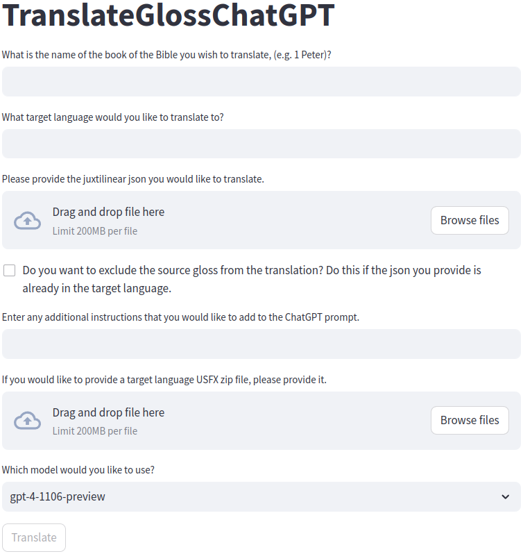

# VerseGlossTranslator


VerseGlossTranslator is a project aimed at translating Bible passages from Greek to French using juxtalinear approach, and then translating from Greek to English utilizing the OpenAI's GPT model (ChatGPT). 

## Installation

Before using VerseGlossTranslator, ensure you have the OpenAI client installed. You can install it via pip:

```bash
pip install openai
```

If you are going to use the Streamlit web gui, you will need to install that as well.
```bash
pip install streamlit
```

If you are going to use the HuggingFace transformers models to run locally, you will need to install transformers as well as a couple other models which the tool set will complain about.

Additionally, you will need an OpenAI API key. Make sure to set up your API key following the instructions provided by OpenAI.

## Usage

### Option 1 **Use the script**

1. Edit the variables in the `main` function of `TranslateGlossChatGPT.py` to specify the input data, book name, and the OpenAI model to be used.
2. Run the script `TranslateGlossChatGPT.py` to perform the translations.
3. To generate HTML files, run `ConvertToHtml.py`.

### Option 2 **Use the web gui**

1. Launch the web gui from the command line using Streamlit.

```bash
streamlit run TranslateGlossChatGPT_StreamlitGui.py
```

2. Fill in the data requested by the web application.
3. Click Translate



# Warning:

This application is experimental and can break.  Because it uses OpenAi credits, you have to watch out that it doesn't get stuck in a loop.  As a failsafe it will wait 10 seconds before trying again the same thing, but you still have to make sure it is working.  Because of this, until you are comfortable with it, it may be best to run the script in a debugger so you can catch what ChatGPT is responding with and what the script is doing with it, when it stops making progress.

One specific thing to watch out for, is that the script blacklists any of the source Greek words from being in the response as there is/was a problem with the GPT model putting both the source and the target in the response.  If there happens to be a very generic greek word that is hard to not be in the output, this restriction may stonewall the progress.  Currently it feels as though this restriction is ok as the Greek uses an entirely different alphabet so even very short words are not likely to validly show up in the output.

## Prerequisites

- OpenAI API key
- OpenAI Python client (`openai`), installed via pip

## Contributing

Contributions to VerseGlossTranslator are welcome! If you have any ideas, suggestions, or bug fixes, please feel free to open an issue or create a pull request.

## License

This project is licensed under the MIT License.